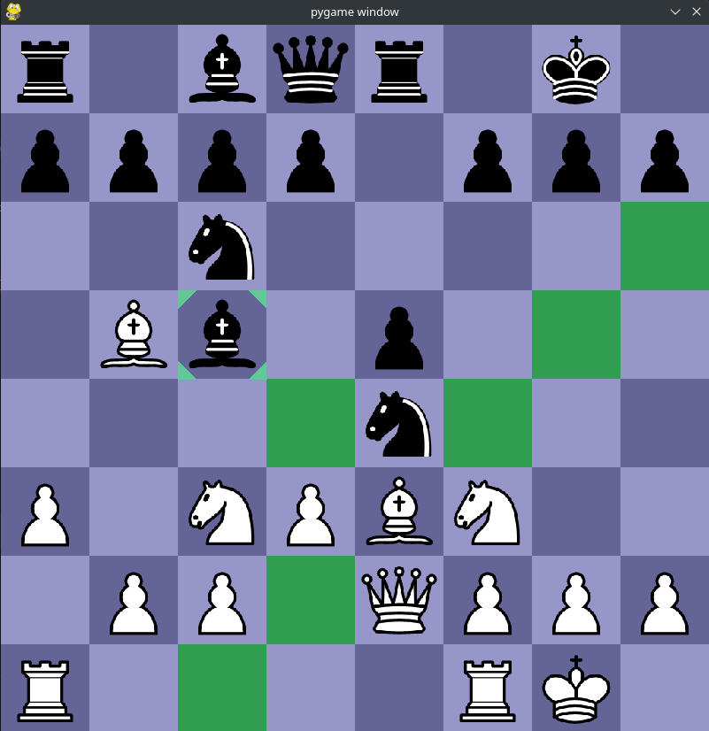

# Summary
This project is a complete **chess engine** written in **Python**, featuring a graphical interface using **Pygame** and move logic powered by **python-chess**. The main focus of the engine is on **efficient move evaluation and decision-making** using classical AI search techniques.



The engine includes:
- **Minimax algorithm** for decision making
- **Alpha-beta pruning** to cut off unpromising branches
- **Iterative deepening** for time-aware depth search
- **Transposition tables** for storing previously seen board states
- **Move ordering** to bring good moves to the top and prune faster
- **Piece-square tables** for positional evaluation

> **Goal:** Play chess intelligently by balancing time constraints with strategic depth.

---


# Engine Architecture Overview

The flow of logic within the engine is as follows:

1. Generate action set (i.e. all possible moves)
2. **Prune** action set (for moves that are unlikely to be good/have already been searched)
3. **Order** action set (to search best lines first)
4. Perform **static analysis** of board
5. Repeat

These actions are iteratively performed to search the input space of possible moves.

## Static Board Evaluation
To evaluate the board, a **material + positional scoring system** is used via **Piece-Square Tables (PSTs)**. Each piece gets a base score plus a bonus or penalty based on its strategic position. For example, the king has the following PST:

|        |        |     |     |     |     |        |        |
|--------|--------|-----|-----|-----|-----|--------|--------|
| 4      | 54     | 47  | -99 | -99 | 60  | 83     | -62    |
| -32    | 10     | 55  | 56  | 56  | 55  | 10     | 3      |
| -62    | 12     | -57 | 44  | -67 | 28  | 37     | -31    |
| -55    | 50     | 11  | -4  | -19 | 13  | 0      | -49    |
| -55    | -43    | -52 | -28 | -51 | -47 | -8     | -50    |
| -47    | -42    | -43 | -79 | -64 | -32 | -29    | -32    |
| -4     | 3      | -14 | -50 | -57 | -18 | 13     | 4      |
| **17** | **30** | -3  | -14 | 6   | -1  | **40** | **18** |

The king's positional score is greatest in the bottom left and right corners (in bold). This indicates to the chess engine that the best position for the king is away from the center, in those corners.

Compare this to the PST for the knight:

|     |        |         |        |        |        |        |     |
|-----|--------|---------|--------|--------|--------|--------|-----|
| -66 | -53    | -75     | -75    | -10    | -55    | -58    | -70 |
| -3  | -6     | **100** | -36    | 4      | **62** | -4     | -14 |
| 10  | **67** | 1       | **74** | **73** | 27     | **62** | -2  |
| 24  | 24     | **45**  | 37     | 33     | 41     | 25     | 17  |
| -1  | 5      | 31      | 21     | 22     | 35     | 2      | 0   |
| -18 | 10     | 13      | 22     | 18     | 15     | 11     | -14 |
| -23 | -15    | 2       | 0      | 2      | 0      | -23    | -20 |
| -74 | -23    | -26     | -24    | -19    | -35    | -22    | -69 |

Since the knight positional score is greatest in the centre of the board, the engine is likely to place it there, where the knight is most powerful.

## Minimax with Alpha-Beta Pruning

This is the main decision function. It recursively evaluates moves while avoiding unnecessary branches:

```python
eval, best_move = self.minimax(board, depth, alpha=-math.inf, beta=math.inf, maximisingPlayer)
```

1. If it's the AI's turn → Maximising player

2. If it's opponent's turn → Minimising player

3. Stops early if an alpha-beta cutoff is found

## Transposition Table Support

The engine stores already evaluated board states for faster reuse:
```python
board_hash = hash(board.fen())
if board_hash in self.transposition_table:
    <use previously calculated value>
```

## Move Ordering

Moves are sorted to evaluate captures first, increasing pruning success:

```python
def order_moves(self, board):
    captures = []
    non_captures = []
    for move in board.legal_moves:
        if board.is_capture(move): captures.append(move)
        else: non_captures.append(move)
    captures.sort(key=lambda move: self.staticEval(board), reverse=True)
    return captures + non_captures
```


## Iterative Deepening

Searches shallow first, then deeper, within a time limit:

```python
while depth < max_depth and time.time() - start < 2: # stops attempt after 2 seconds
    eval, best_move = self.minimax(...)
```

# System Design
## Component Diagram

TODO

Future Improvements

    Add Zobrist hashing for faster board hashing

    Implement quiescence search to reduce horizon effect

    Introduce openings book and endgame tablebases

    Upgrade evaluation function (king safety, pawn structure, mobility)